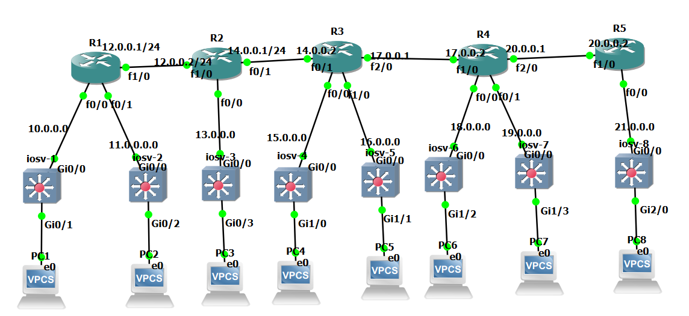

# Enterprise Multi-Area OSPF Network Simulation & Hardening
A comprehensive enterprise network topology built and simulated using GNS3, focusing on advanced OSPF routing protocols, area structuring, security, and high availability.

## Project Overview
This project simulates a multi-area enterprise network infrastructure designed to ensure seamless routing, redundancy, and secure communication between routers using industry-standard protocols. The topology addresses complex multi-area routing challenges, boundary optimization, and core network hardening techniques.

## Key Technologies & Features
* **OSPFv2 Multi-Area Design:** Configured and optimized across multiple areas (Backbone Area 0 and Non-Backbone Areas) to reduce routing overhead and structure large-scale enterprise traffic efficiently.
* **OSPF Virtual-Links:** Implemented specialized virtual-link connections to maintain continuous, uninterrupted connectivity to the backbone area when standard direct area connection paths were interrupted or partitioned.
* **Network Security & Authentication:** Enabled MD5 (Message-Digest) cryptographic authentication on OSPF interfaces to secure routing update exchanges and prevent unauthorized router adjacencies or spoofing attacks.
* **Router-ID & Priority Optimization:** Tuned Router-IDs and interface priorities meticulously to control Designated Router (DR) and Backup Designated Router (BDR) elections, ensuring predictable network convergence.
* **Infrastructure Integration:** Integrated default information origination and static routing to handle external traffic distribution smoothly.

## Network Topology Architecture
The simulated topology consists of multiple interconnected Cisco routers configured to test real-world scenarios, fallback mechanisms, link-state advertisement (LSA) database synchronization, and robust security policies.

## Network Topology

## Repository Files
* Contains the complete router running-configurations (`R1` through `R6`) and the network topology diagram deployed in the simulation environment.

## Author
Ahmed Ashraf
